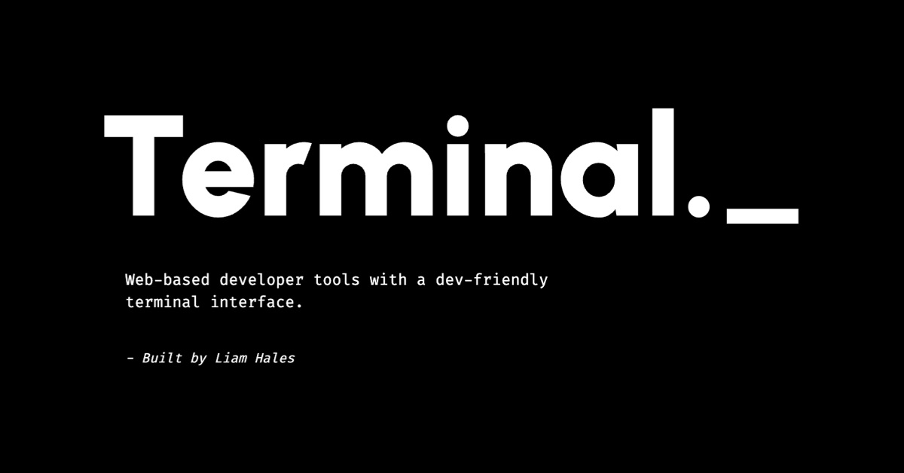

<div>
  
  <h1>
    Terminal
  </h1>
  <p>
    Terminal is a web app created to provide web-based developer tools with a dev-friendly terminal interface.
</p>
  <a
    href="https://cli.liamhales.dev"
    target="_blank"
  >
    https://cli.liamhales.dev
  </a>
  <br/>
  <br/>
  <br/>
  <a
    href="https://github.com/liam-hales/terminal/deployments?environment=Production"
    target="_blank"
  >
    
  </a>
</div>

<br/>
<br/>

# Docs 📑

> ⚠️ _**WARNING** - Please make sure to follow the [Getting Started](#getting-started-) section first to avoid running into any issues._

- [Built With 🛠️](#built-with-)
- [Getting Started 🚀](#getting-started-)
- [Local Development 👨🏻‍💻](#local-development-)
  - [Development Server](#development-server)
  - [Production Server](#production-server)
- [Production 🌍](#production-)
  - [Building](#building)
  - [Deploying](#deploying)
  - [Bundle Analysing](#bundle-analysing)
- [Public Assets 🌆](#public-assets-)
- [Dependency Management 📦](#dependency-management-)
  - [Options](#options)

<br/>
<br/>

# Built With 🛠️

This app was built and hosted with the following technologies. For a full list of dependencies used, see the [`package.json`](/package.json) file.

<br/>

<div>
  <a
    href="https://typescriptlang.org"
    target="_blank"
  >
    
  </a>
  <a
    href="https://reactjs.org"
    target="_blank"
  >
    
  </a>
  <a
    href="https://nextjs.org"
    target="_blank"
  >
    
  </a>
  <a
    href="https://tailwindcss.com"
    target="_blank"
  >
    
  </a>
<div>

<br/>
<br/>

# Getting Started 🚀

1. Download and install [Node Version Manager]
2. Install and use a version of Node.js `>= v22.11`

```sh
$ nvm install 22.11
$ nvm use 22.11

$ node --version
v22.11.0

$ npm --version
v10.9.0
```

3. Run `corepack enable` to enable [Corepack]
4. You should now be able to use the [`yarn`] package manager which you **MUST** use for this project

> 📝 _**NOTE** - Yarn comes bundled with [Corepack] and is the preferred way to install/manage Yarn. Check out the [Yarn Installation Guide] for more info_

```sh
$ yarn --version
v4.5.3
```

> 📝 _**NOTE** - The current version of Yarn should match the `packageManager` version in the [`package.json`](/package.json)_

5. Run `yarn` in the project root
6. Create a `.env` file in the project root

```sh
SITE_URL = 'https://cli.liamhales.dev'
FILE_STORE_ID = '******'
FILE_READ_WRITE_TOKEN = '******'
```

<br/>
<br/>

# Local Development 👨🏻‍💻

For local development there are two ways to build and start the app depending on your specific needs...

* [Development Server](#development-server) - Should be used when developing the app
* [Production Server](#production-server) - Should be used to simulate how the app will run in production

## Development Server

1. Run `yarn start:dev` to start the development server

```sh
$ yarn start:dev
```

## Production Server

1. Run `yarn build` to build the app for production
2. Run `yarn start:prod` to start the production server

```sh
$ yarn build
$ yarn start:prod
```

<br/>
<br/>

# Production 🌍

## Building

1. Run `yarn build` to build the app for production

```sh
$ yarn build
```

## Deploying

The app is hosted on [AWS Amplify] and is built and deployed using their GitHub integration and auto-build feature. When code is pushed to the repos `main` branch, a production build and deployment is triggered. No need to manually build or deploy.

```sh
$ git checkout main
$ git add --all
$ git commit -m "Fixed bugs"
$ git push
```

## Bundle Analysing

Analysing a production bundle is done using `@next/bundle-analyzer` under the hood and is used to inspect the app and the size each page, component and dependency takes up within the bundle.

1. Run `yarn build:analyse` to build and analyse the app for production
2. Open the generated `.html` files located in `.next/analyze`

```sh
$ yarn build:analyse
```

> ⚠️ _**WARNING** - The bundle analyser will automatically open the generated `.html` files in your default browser_

<br/>
<br/>

# Public Assets 🌆

Most public assets already exist in the `/public` directory, however some assets such as some of the icons are dynamically built using build scripts.

1. Run `yarn build:icons` to build the `favicon.ico` and `.webp` icons

```sh
$ yarn build:icons
```

> 📝 _**NOTE** - These public assets are not required for a functional build_

> 📝 _**NOTE** - Public assets such as the `sitemap.xml` and `robots.txt` files exists on dynamic routes_

<br/>
<br/>

# Dependency Management 📦

Managing dependencies is done using `npm-check-updates` under the hood which has the ability to check for new dependency versions and upgrade dependencies to a specified target version.

1. Run `yarn deps` to list upgradable dependencies

## Options

- `--target ${latest | minor | patch}` to scope dependencies to a specific target version
- `--upgrade` to upgrade dependencies
- `--interactive` to choose which dependencies to upgrade in interactive mode

Check out the [`npm-check-updates`] docs or run `yarn ncu --help` for more info.

[Node Version Manager]: https://github.com/nvm-sh/nvm
[`yarn`]: https://yarnpkg.com
[Yarn Installation Guide]: https://yarnpkg.com/getting-started/install
[Corepack]: https://nodejs.org/api/corepack.html
[AWS Amplify]: https://aws.amazon.com/amplify
[`npm-check-updates`]: https://npmjs.com/package/npm-check-updates
